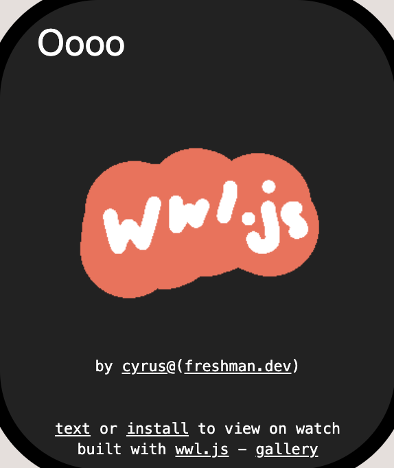

wwl.js (web-watch-library)  
Some might consider this a framework, but WWF is taken  
v0.0.7  

Interactive builder: https://wwl-builder.tu.fo  
Gallery: https://raw.tu.fo/wwl/app/gallery  

Example: (view at https://raw.tu.fo/wwl/app/example)  
```
<head>
  <title>toggle</title>
  <meta name="description" content="wwl.js example" />
  <meta name="author" content="cyrus@freshman.dev">
  <link rel="icon" href="../icon-js.png">
</head>
<body>
  <script src="../wwl.js"></script>
  <script>
    wwl.attach({
      state: 0,
      states: [
        '<button id=1>off</button>',
        {
          html: '<button id=0>on</button>',
          style: 'filter: invert(1)',
        },
      ],
    })
  </script>
</body>
```


