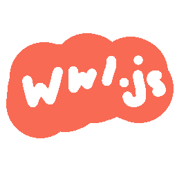
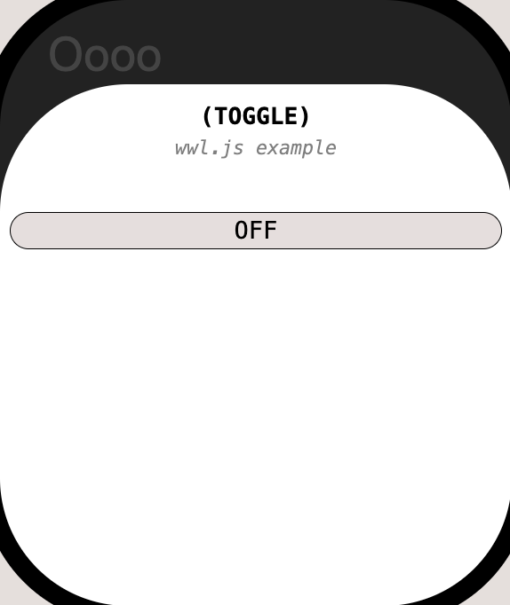
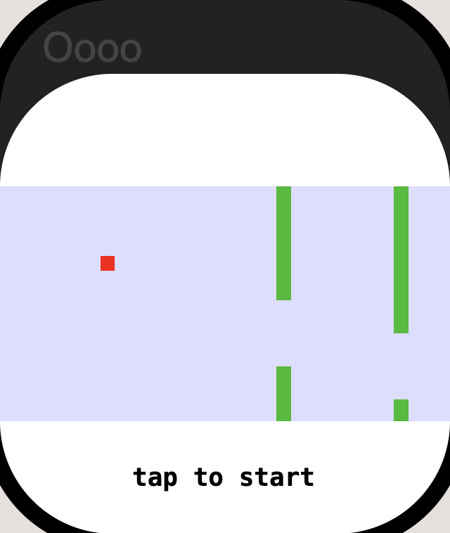

wwl.js (web-watch-library) @ https://freshman.dev/lib/2/wwl/script.js  
Some might consider this a framework, but WWF is taken  
v0.0.7  
  
Interactive builder: https://freshman.dev/wwl-builder  
Gallery: https://freshman.dev/raw/wwl/app/gallery  
Example: (view at https://freshman.dev/raw/wwl/app/example)  

```
<head>
  <title>toggle</title>
  <meta name="description" content="wwl.js example" />
  <meta name="author" content="cyrus@freshman.dev">
  <link rel="icon" href="/lib/2/wwl/icon.png">
</head>
<body>
  <script src="/lib/2/wwl/script.js"></script>
  <script>
    wwl.attach({
      state: 0,
      states: [
        '<button id=1>off</button>',
        {
          html: '<button id=0>on</button>',
          style: 'filter: invert(1)',
        },
      ],
    })
  </script>
</body>
```

 &nbsp;  &nbsp; 